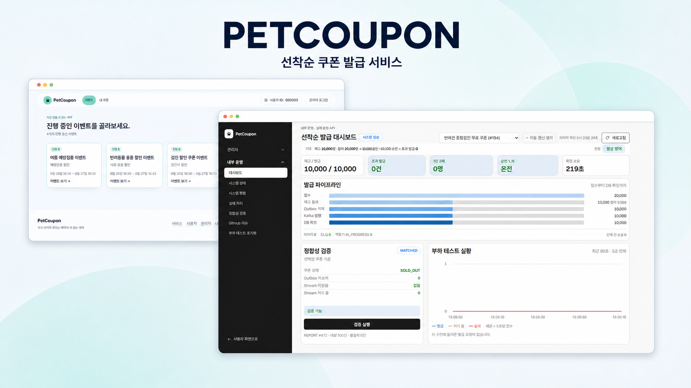
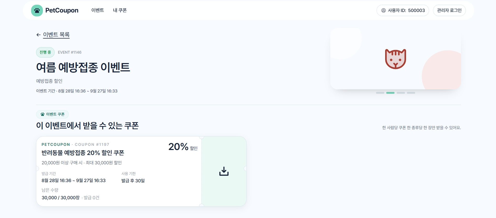
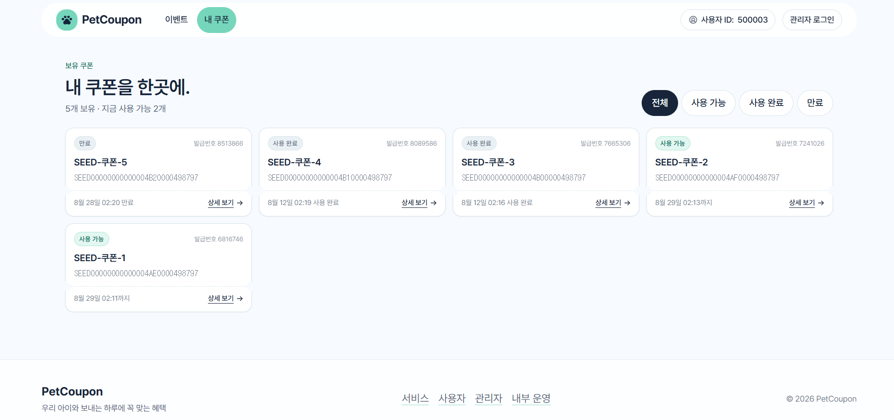
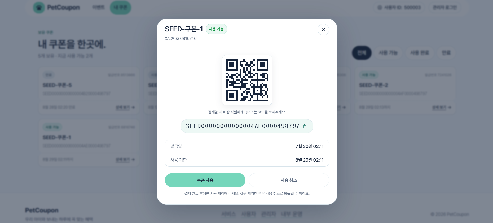

# PetCoupon Frontend

반려동물 이벤트 기반 선착순 쿠폰 발급 시스템의 프론트엔드입니다. 사용자의 쿠폰 발급·사용 흐름부터 관리자 이벤트/쿠폰 관리, 운영 대시보드와 장애 대응 화면까지 하나의 애플리케이션에서 제공합니다.

<p align="center">
  
</p>

## 주요 화면

### 1. 이벤트 상세 및 쿠폰 발급

이벤트에 연결된 쿠폰의 혜택과 실시간 재고를 확인하고 발급받을 수 있습니다.



### 2. 내 쿠폰 목록

사용 가능, 사용 완료, 만료 상태별로 보유 쿠폰을 확인할 수 있습니다.



### 3. 내 쿠폰 상세

QR과 쿠폰 코드를 확인하고 쿠폰 사용 또는 사용 취소를 처리할 수 있습니다.



## 주요 기능

- **서비스**: 진행 중 이벤트 조회, 이벤트별 쿠폰 및 실시간 재고 확인, 선착순 쿠폰 발급
- **사용자**: 테스트 사용자 ID 설정, 보유 쿠폰 조회, 쿠폰 상세·사용·사용 취소
- **관리자**: 관리자 세션 인증, 이벤트 생성·수정·상태 변경, 쿠폰 생성·수정·재고 확인
- **내부 운영**: 발급 대시보드, 시스템 상태, 실시간 WARN/ERROR 로그, DLQ 재처리, 정합성 검증, 부하 테스트 초기화

## 🛠 Tech Stack

### Application


### Styling · Interaction


### Build · Quality


## 로컬 실행

### 사전 준비

- Node.js와 npm
- `http://localhost:8080`에서 실행 중인 [`petcoupon-backend`](https://github.com/PetCare-Platform/petcoupon-backend)
- 백엔드가 사용하는 MySQL, Redis, Kafka

백엔드 인프라와 애플리케이션의 자세한 실행 방법은 백엔드 저장소 README를 따릅니다. 프론트엔드 개발 서버는 `/api/*` 요청을 `vite.config.ts`의 프록시를 통해 `http://localhost:8080`으로 전달합니다.

### 프론트엔드 실행

```bash
npm install
npm run dev
```

Windows PowerShell에서 실행 정책으로 `npm.ps1`이 차단되면 다음 명령을 사용합니다.

```powershell
npm.cmd install
npm.cmd run dev
```

브라우저에서 `http://localhost:5173`으로 접속합니다.

## 인증과 사용자 설정

### 사용자

실제 로그인 시스템은 프로젝트 범위에 포함되지 않습니다. `/user` 화면에서 DB에 존재하는 테스트 사용자 ID를 설정하며, 선택한 값은 브라우저 `localStorage`에 저장됩니다. 사용자 ID가 없거나 DB에 존재하지 않으면 쿠폰을 발급할 수 없습니다.

### 관리자

`/admin/auth`에서 백엔드에 설정된 관리자 인증 코드로 세션을 발급합니다. 발급된 세션 토큰은 현재 브라우저 탭의 `sessionStorage`에 저장되며, `/admin/**` 요청에 `X-ADMIN-KEY` 헤더로 자동 첨부됩니다.

인증 코드나 운영 환경의 비밀값은 프론트엔드 소스와 README에 저장하지 않습니다.

## 화면 구성

`src/routes.ts`의 `AREA_ROUTES`가 영역 전환 메뉴와 하위 내비게이션의 기준입니다. 페이지를 추가하거나 제거할 때는 이 파일과 `src/App.tsx`의 라우트를 함께 변경해야 합니다.

| 영역 | 주요 경로 | 기능 |
| --- | --- | --- |
| 서비스 | `/`, `/event-detail/:id` | 공개 이벤트 목록, 쿠폰 정보·재고 조회, 쿠폰 발급 |
| 사용자 | `/user`, `/user/my-coupons`, `/user/coupon-detail/:couponIssueId` | 사용자 ID 설정, 내 쿠폰 조회·사용·취소 |
| 관리자 | `/admin/auth`, `/admin`, `/admin/events`, `/admin/event-form`, `/admin/coupons`, `/admin/coupon-form` | 관리자 인증, 이벤트·쿠폰 관리 |
| 내부 운영 | `/internal/dashboard`, `/internal/health`, `/internal/monitoring`, `/internal/failures`, `/internal/verification`, `/internal/repo-issues`, `/internal/load-test-reset` | 운영 지표, 헬스체크, 로그 스트림, DLQ, 정합성 검증, 테스트 초기화 |

## 백엔드 연동 범위

`src/api/http.ts`가 백엔드의 `CustomResponse` 응답을 해제하고 HTTP 오류와 네트워크 오류를 구분합니다. API DTO는 `src/types/api.ts`, 도메인별 요청 함수는 `src/api/*.ts`에 정의되어 있습니다.

현재 다음 흐름이 실제 백엔드 API와 연결되어 있습니다.

- 공개 이벤트 목록·상세 및 쿠폰 실시간 재고 조회
- 멱등키를 포함한 비동기 쿠폰 발급, 처리 상태 확인, 사용자 보유 쿠폰 조회
- 쿠폰 상세 조회, 사용 및 사용 취소
- 관리자 세션 발급·폐기
- 관리자 이벤트 생성·조회·수정·상태 변경
- 관리자 쿠폰 생성·목록·수정·실시간 재고 조회
- 발급 요약, 처리량·상태 분포, 시계열, 실패 사유 및 파이프라인 상태
- 시스템 헬스체크와 Actuator 지표 조회
- 관리자 WARN/ERROR 로그 SSE 스트림 및 스트림 ON/OFF 설정
- DLQ 목록·재처리, 정합성 검증 실행·이력 조회
- 부하 테스트용 쿠폰 상태 조회 및 재고 초기화

실시간 모니터링은 관리자 인증 헤더가 필요하므로 네이티브 `EventSource` 대신 `fetch` 기반 SSE 스트림을 사용합니다. 연결이 끊긴 동안 발생한 로그는 재전송되지 않으며 현재 탭에는 최근 100건만 보관합니다.

## 시연 데이터

시연용 이벤트·쿠폰은 프론트엔드 목데이터가 아니라 백엔드 API와 DB에 생성합니다. 백엔드 저장소의 다음 스크립트를 사용하면 진행 중 이벤트 4개와 쿠폰·Redis 재고를 준비할 수 있습니다.

```bash
./load-test/scripts/setup-demo-coupon.sh
```

스크립트는 여러 번 실행할 때마다 데이터를 새로 생성하므로 중복 실행에 주의합니다. 세부 옵션과 초기화 방법은 백엔드의 `load-test/README.md`를 확인합니다.

## 프로젝트 구조

```text
src/
  api/         도메인별 API 클라이언트와 공통 HTTP 래퍼
  components/  레이아웃, 헤더, 푸터 및 공용 UI
  context/     토스트 등 전역 컨텍스트
  lib/         날짜 포맷 등 공용 유틸리티
  pages/       public, user, admin, internal 영역별 페이지
  types/       백엔드 DTO에 대응하는 TypeScript 타입
  routes.ts    영역 및 내비게이션 설정
```

## 검증 명령

```bash
npm run lint
npm run build
npm run check:api-coverage
```

- `lint`: ESLint 정적 검사
- `build`: TypeScript 검사 후 프로덕션 번들 생성
- `check:api-coverage`: 백엔드 API 연동 목록과 프론트 API 클라이언트 누락 여부 검사

## 현재 제한 사항

- 사용자 로그인·회원가입은 구현하지 않았으며 테스트 사용자 ID를 직접 설정합니다.
- 관리자 쿠폰 수정 화면은 별도 쿠폰 단건 조회 API가 없어 관리자 쿠폰 목록 데이터를 사용합니다.
- `/internal/health`의 Actuator 화면은 백엔드에서 노출한 엔드포인트와 지표만 표시할 수 있습니다.
- GitHub 이슈 화면은 GitHub 공개 API를 사용하므로 API 제한의 영향을 받을 수 있습니다.
- 관리자 세션과 실시간 로그 목록은 브라우저 탭을 닫으면 유지되지 않습니다.

## 관련 저장소

- [PetCoupon Backend](https://github.com/PetCare-Platform/petcoupon-backend)
